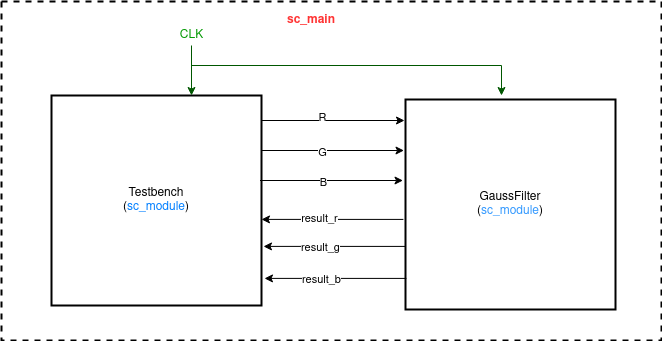

# Homework - 1 : gaussian filter FIFO anf buffer

## I. Introduction
In this homework we are told to implement a gaussian filter module with SystemC FIFO channels. We also have to use a buffer to send in batch a row or a column of image pixels from testbench to the filter. We were provided with a resource talking about different kinds of filters. Here we are dealing with a gaussian blur filter which is the result of blurring an image by a gaussian function (named after mathematician and scientist Carl Friedrich Gauss). The gauss function can be formulated as follows : 
>[1 / (2.pi.(sigma)^2)]e^-(x^2 / 2.(sigma)^2)]


It is a widely used effect in graphics software, typically to reduce image noise and reduce detail. The kernel I used is described here: 

```c++
double filter[filterHeight][filterWidth] =
{
  1, 2, 1,
  2, 4, 2,
  1, 2, 1,
};

double factor = 1.0 / 16.0;
double bias = 0.0;
```

## II. Implementation details
### _Part-1_ : FIFO

In this part I implemented the FIFO channels to build a gaussian blur filter in SystemC using the codes provided by the TAs.  The gaussian function is described here : 

```c++
void Testbench::do_gauss(){
    double R, G, B = 0.0;
    int w = width, h = height;
    int v, u;        // for loop counter
    int adjustX, adjustY, xBound, yBound; //for kernel counter
    o_rst.write(false);
    wait(5);
    o_rst.write(true);
    
    for (int i = 0; i < h; i++)
    {
        for (int j = 0; j < w; j++)
        {
            adjustX = (MASK_X % 2) ? 1 : 0; // 1 in case of 3x3 kernel
            adjustY = (MASK_Y % 2) ? 1 : 0; // 1
            xBound = MASK_X / 2;            // 1
            yBound = MASK_Y / 2;            // 1
           
            for (v = -yBound; v != yBound + adjustY; ++v) {   //-1, 0, 1
              for (u = -xBound; u != xBound + adjustX; ++u) { //-1, 0, 1
                if (i + u >= 0 && i + u < width && j + v >= 0 && j + v < height) {

                    R = *(source_bitmap +
                          bytes_per_pixel * (width * (j + v) + (i + u)) + 2);
                    G = *(source_bitmap +
                          bytes_per_pixel * (width * (j + v) + (i + u)) + 1);
                    B = *(source_bitmap +
                          bytes_per_pixel * (width * (j + v) + (i + u)) + 0);
                }
                else{
                    R=0;
                    G=0;
                    B=0;
                    }
                    
                    o_r.write(R);
                    o_g.write(G);
                    o_b.write(B);
                }
            }
            
            
            
            *(target_bitmap + bytes_per_pixel * (width * j + i) + 2) = int (i_result_r.read());
            *(target_bitmap + bytes_per_pixel * (width * j + i) + 1) = int (i_result_g.read());
            *(target_bitmap + bytes_per_pixel * (width * j + i) + 0) = int (i_result_b.read());
        }
    }
}
```

### _Part-2_ : Buffer

In this part I implemented the gaussian blur in SystemC using a buffer. First we read each pixels and then store them in a buffer using the code described here : 

```c++
    w = i_width.read();
    h = i_height.read();

    int r[3][w];
    int g[3][w];
    int b[3][w];
    int cnt;
    for(y = 0 ; y < h ; y++) {    
        if(y < h - 1){
            for(cnt = 0 ;c < w ; c++) { //reading
                r[2][cnt] = i_r.read();
                g[2][cnt] = i_g.read();
                b[2][cnt] = i_b.read();
            }
        }
        
        for(x = 0 ; x < w; x++){
            R = G = B = 0;
            for (i = -1 ; i < filterHeight - 1 ; i++) {
                for (j = -1 ; j < filterWidth - 1 ; j++) {
                    if(0<=y+i && y+i<height && 0<=x+j && x+j<width){
                        R += r[i+1][x+j+1] * filter[i+1][j+1];
                        G += g[i+1][x+j+1] * filter[i+1][j+1];
                        B += b[i+1][x+j+1] * filter[i+1][j+1];
                    }
                }
            }
            o_r.write(R);
            o_g.write(G);
            o_b.write(B);
            
        }
        //shifting
        for(i = 0 ;i < w ; i++) { 
            r[0][i] = r[1][i];
            g[0][i] = g[1][i];
            b[0][i] = b[1][i];
            r[1][i] = r[2][i];
            g[1][i] = g[2][i];
            b[1][i] = b[2][i];
            r[2][i] = g[2][i] = b[2][i] = 0;
        }
        
    }
}
 
```

## III. Design Model
The design is exactly same as HW1. 



## IV. Experimental results
### FIFO 
|original input | blurred output|
|---------------|---------------|
|||

### Buffer
```sh
[ 20%] Building CXX object CMakeFiles/gauss.dir/Testbench.cpp.o
[ 40%] Building CXX object CMakeFiles/gauss.dir/main.cpp.o
[ 60%] Linking CXX executable gauss
[ 80%] Built target gauss
[100%] Generating out.bmp

        SystemC 2.3.3-Accellera --- Apr 23 2021 09:18:29
        Copyright (c) 1996-2018 by all Contributors,
        ALL RIGHTS RESERVED
Number of pixel sent: 58668

Info: /OSCI/SystemC: Simulation stopped by user.
Simulated time == 59928 ns
[100%] Built target run
```
## V. Discussion and Conclusion
In this homework I learnt the use of a buffer to save up some space in memory. Redundancy to read the data can be reduced and hence memory consumption can be reduced by a good amount. The TAs sample code has been very helpful in the FIFO part, though in the second part a lot of thins had to be done by us. The most basic difference I felt was the creation of buffers r[3][w], g[3][w] and b[3][w] and store pixels values coming from the testbench.cpp file.  

