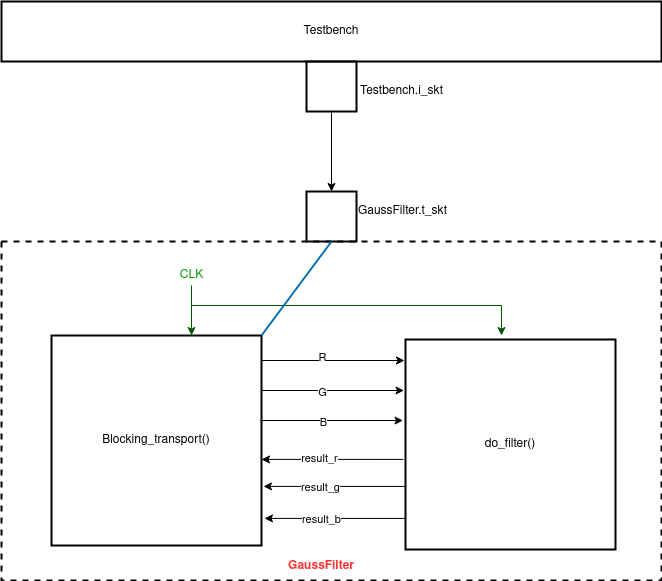

# Homework - 3 : gaussian filter with TLM 2.0 

## I. Introduction
In this homework we are told to wrap the gaussian blur we created in HW2 with TLM 2.0 sockets. All the modules created were communicated through TLM blocking transport. Here we are dealing with a gaussian blur filter which is the result of blurring an image by a gaussian function (named after mathematician and scientist Carl Friedrich Gauss). The gauss function can be formulated as follows : 
>[1 / (2.pi.(sigma)^2)]e^-(x^2 / 2.(sigma)^2)]


It is a widely used effect in graphics software, typically to reduce image noise and reduce detail. The kernel I used is described here: 

```c++
double filter[filterHeight][filterWidth] =
{
  1, 2, 1,
  2, 4, 2,
  1, 2, 1,
};

double factor = 1.0 / 16.0;
double bias = 0.0;
```

## II. Implementation details

In this part I implemented the TLM 2.0 transation with a gaussian blur filter in SystemC using the codes provided by the TAs. There is an initiator and target socket created between the testbench and the GaussFilter module, where the filter module is a TLM target. The TLM interface has been created as follow :

> NOTE: These are some code snippets and not the entire code

```c++
GaussFilter::GaussFilter(sc_module_name n)
    : sc_module(n), t_skt("t_skt"){
  SC_THREAD(do_filter);
  t_skt.register_b_transport(this, &GaussFilter::blocking_transport);
}  

void GaussFilter::blocking_transport(tlm::tlm_generic_payload &payload,
                                     sc_core::sc_time &delay) {
  sc_dt::uint64 addr = payload.get_address();
  unsigned char *mask_ptr = payload.get_byte_enable_ptr();
  unsigned char *data_ptr = payload.get_data_ptr();
  int r, g, b;
  switch (payload.get_command()) {
  case tlm::TLM_READ_COMMAND:
    switch (addr) {
    case GAUSS_FILTER_RESULT_ADDR:
      r = result_r.read();
      g = result_g.read();
      b = result_b.read();
      break;
    }
    data_ptr[0] = r;
    data_ptr[1] = g;
    data_ptr[2] = b;
    data_ptr[3] = 0;
    break;

}
```

## III. Design Model




## IV. Experimental results

|original input | blurred output|
|---------------|---------------|
|||


## V. Discussion and Conclusion
In this homework I learnt the use of TLM 2.0 interface to efficiently manage data transaction.By using TLM initiator and target sockets with blocking transport we can regulate the transfer of data within modules very easily. The TAs sample code has been very helpful in writing the TLM interface. The most basic difference I felt was the creation of TLM sockets and managing data flow accordingly.  

