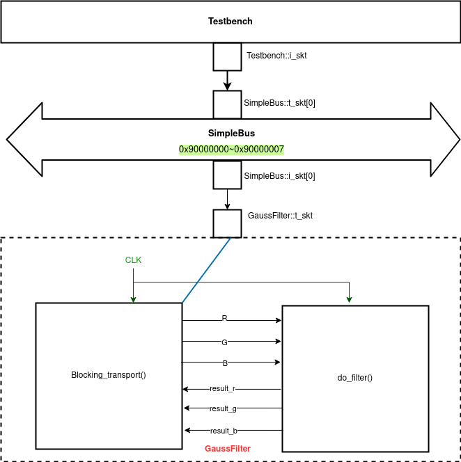

# Homework - 4 : gaussian filter with TLM 2.0 Bus

## I. Introduction
In this homework we are told to connect the testbench and gaussian blur module (we created in HW3 using TLM interface) using a TLM 2.0 bus. All the modules created were communicated through TLM blocking transport. Here we are dealing with a gaussian blur filter which is the result of blurring an image by a gaussian function (named after mathematician and scientist Carl Friedrich Gauss). The gauss function can be formulated as follows : 
>[1 / (2.pi.(sigma)^2)]e^-(x^2 / 2.(sigma)^2)]


It is a widely used effect in graphics software, typically to reduce image noise and reduce detail. The kernel I used is described here: 

```c++
double filter[filterHeight][filterWidth] =
{
  1, 2, 1,
  2, 4, 2,
  1, 2, 1,
};

double factor = 1.0 / 16.0;
double bias = 0.0;
```

## II. Implementation details

In this part I implemented the TLM 2.0 transation with a gaussian blur filter in SystemC using the codes provided by the TAs. There is an initiator and target socket created between the testbench and the GaussFilter module, where the filter module is a TLM target. The module Testbench and GaussFilter are the same as those in HW3. The TLM interface has been created as follow :

> NOTE: These are some code snippets from main.cpp to show the flow of code

```c++
Testbench tb("tb");
SimpleBus<1, 1> bus("bus");
bus.set_clock_period(sc_time(CLOCK_PERIOD, SC_NS));
GaussFilter Gauss_filter("Gauss_filter");
tb.initiator.i_skt(bus.t_skt[0]);
bus.setDecode(0, Gauss_MM_BASE, Gauss_MM_BASE + Gauss_MM_SIZE - 1);
bus.i_skt[0](Gauss_filter.t_skt);

```

## III. Design Model




## IV. Experimental results

|original input | blurred output|
|---------------|---------------|
|||


## V. Discussion and Conclusion
In this homework I learnt the use of TLM 2.0 bus interface to efficiently manage data transaction. By using TLM initiator and target sockets with blocking transport we can regulate the transfer of data within modules very easily. The TAs sample code has been very helpful in writing the TLM interface. The only difference is that now Testbench write pixels and read results through a bus module SimpleBus to and from GaussFilter.  

