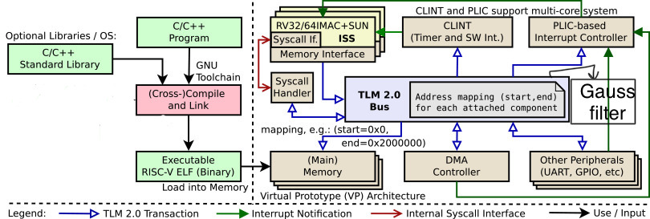

# Homework - 6 : gaussian filter in RISC-V

## I. Introduction
In this homework we are told to port the Gaussian blur module to the "basic-acc" platform given by the TAs. We are guided to use the RISCV-VP core models to control hardware modules on the platform. RISC V virtual platform is implemented in SystemC TLM-2.0. It is useful scince it is flexible for both hardware and software simuntaneously. Here we are dealing with a gaussian blur filter which is the result of blurring an image by a gaussian function (named after mathematician and scientist Carl Friedrich Gauss). The gauss function can be formulated as follows : 
>[1 / (2.pi.(sigma)^2)]e^-(x^2 / 2.(sigma)^2)]


It is a widely used effect in graphics software, typically to reduce image noise and reduce detail. The kernel I used is described here: 

```c++
double filter[filterHeight][filterWidth] =
{
  1, 2, 1,
  2, 4, 2,
  1, 2, 1,
};

double factor = 1.0 / 16.0;
double bias = 0.0;
```

## II. Implementation details

We are givena RISC V docker image which contains the source code for a sobel filter. We were asked to use these codes provided by the TAs for a gaussian blur filter. There are two parts in this implementation :

- Use RISCV-VP model with TLM 2.0 interface.
- Write a software application to control the hardware modules through bus.

Now I will show the things which are added in our case of gauss filter. First I will go through the Platform and then the src.

- Platform 
Inside the platform we have the gaussfilter.h file and the main file which is the main software link. The code which is added on top of soble filter is mentioned here: 
 > NOTE: This is just some snaps from the code and not the complete code. 

```c++

#include "GaussFilter.h"

class BasicOptions : public Options {
public:
	typedef unsigned int addr_t;
	addr_t gaussFilter_start_addr = 0x75000000;
	addr_t gaussFilter_size = 0x01000000;
	addr_t gaussFilter_end_addr = gaussFilter_start_addr + gaussFilter_size - 1;
	
	}


int sc_main(int argc, char **argv) {
	GaussFilter gauss_filter("gauss_filter");

	// address mapping
	
	bus.ports[14] = new PortMapping(opt.gaussFilter_start_addr, opt.gaussFilter_end_addr);

	// connect TLM sockets

	bus.isocks[14].bind(gauss_filter.tsock);
```
- Src
 The src folder contains the main.cpp file which is essential for hardware communicaton. The sample code is decribed here : 

```c++
// Gauss Filter 
static char* const GAUSSFILTER_START_ADDR = reinterpret_cast<char* const>(0x75000000);
static char* const GAUSSFILTER_READ_ADDR  = reinterpret_cast<char* const>(0x75000004);

void write_data_to_ACC(char* ADDR, unsigned char* buffer, int len){}
void read_data_from_ACC(char* ADDR, unsigned char* buffer, int len){}

int main() {
  #include "lena_std_short.h" //included here to avoid compiler issue of not initializing global arrays
	unsigned char* source_array= lena_std_short_bmp;
  
  unsigned char  buffer[4] = {0};
  for(int i = 0; i < width; i++){
    for(int j = 0; j < length; j++){
      for(int v = -1; v <= 1; v ++){
        for(int u = -1; u <= 1; u++){
          if((v + i) >= 0  &&  (v + i ) < width && (u + j) >= 0 && (u + j) < length ){
            buffer[0] = *(source_bitmap + bytes_per_pixel * ((j + u) * width + (i + v)) + 2);
            buffer[1] = *(source_bitmap + bytes_per_pixel * ((j + u) * width + (i + v)) + 1);
            buffer[2] = *(source_bitmap + bytes_per_pixel * ((j + u) * width + (i + v)) + 0);
            buffer[3] = 0;
          }else{
            buffer[0] = 0;
            buffer[1] = 0;
            buffer[2] = 0;
            buffer[3] = 0;
          }
          write_data_to_ACC(GAUSSFILTER_START_ADDR, buffer, 4);
        }
      }
      read_data_from_ACC(GAUSSFILTER_READ_ADDR, buffer, 4);
}
    }
}

```

## III. Design Model



## IV. Experimental results

### 1. We will first build the "basic-acc" platform of riscv-vp and run the vp as follow : 

```sh
$ cd build
$ cmake ..
$ make install
-----------------------------------------------------------
user@ubuntu:~/ee6470/riscv-vp/vp/build$ make install
[  8%] Built target core-common
[ 17%] Built target gdb
[ 25%] Built target gdb-mc
[ 29%] Built target rv32
[ 34%] Built target rv64
[ 44%] Built target platform-common
[ 49%] Built target platform-basic
[ 52%] Built target riscv-vp
[ 56%] Built target platform-basic-acc
[ 59%] Built target riscv-vp-acc
[ 74%] Built target hifive-vp
[ 77%] Built target tiny32-vp
[ 80%] Built target tiny32-mc
[ 85%] Built target platform-tiny32-mc
[ 88%] Built target tiny64-vp
[ 91%] Built target tiny64-mc
[ 94%] Built target test32-vp
[ 97%] Built target linux-vp
[100%] Built target linux32-vp
Install the project...
-- Install configuration: "Debug"

```
### 2. Next we will run the basic gaussian filter software (sw) as follow 

```sh
$ cd $EE6470
$ cd riscv-vp/sw
$ cd gauss
$ make
$ make sim
--------------------------------------------------------------
user@ubuntu:~/ee6470/riscv-vp/sw/gauss$ make sim
riscv32-unknown-elf-g++ -std=c++14 main.cpp -o main -march=rv32ima -mabi=ilp32
~/ee6470/riscv-vp/vp/build/bin/riscv-vp-acc --intercept-syscalls main

        SystemC 2.3.3-Accellera --- Jun 17 2021 16:50:52
        Copyright (c) 1996-2018 by all Contributors,
        ALL RIGHTS RESERVED
======================================
	  Reading from array
======================================
 input_rgb_raw_data_offset	= 54
 width				= 256
 length				= 256
 bytes_per_pixel		= 3
======================================

Info: /OSCI/SystemC: Simulation stopped by user.
=[ core : 0 ]===========================
simulation time: 3494287520 ns
zero (x0) =        0
ra   (x1) =    10696
sp   (x2) =  1ffffec
gp   (x3) =    508f0
tp   (x4) =        0
t0   (x5) =       20
t1   (x6) =    30000
t2   (x7) =        1
s0/fp(x8) =        0
s1   (x9) =        0
a0  (x10) =        0
a1  (x11) =        0
a2  (x12) =      4c1
a3  (x13) =        0
a4  (x14) =        0
a5  (x15) =        0
a6  (x16) =        1
a7  (x17) =       5d
s2  (x18) =        0
s3  (x19) =        0
s4  (x20) =        0
s5  (x21) =        0
s6  (x22) =        0
s7  (x23) =        0
s8  (x24) =        0
s9  (x25) =        0
s10 (x26) =        0
s11 (x27) =        0
t3  (x28) =        3
t4  (x29) =        2
t5  (x30) =     8800
t6  (x31) =        5
pc = 1b6a8
num-instr = 94200746


```


## V. Discussion and Conclusion
In this homework I learnt to port gaussian filter with risc V virtual platform. The "basic-acc" codes provided by TAs has been very helpful, since its hard and complicated to bulit it from scratch. There were a lot of commands which I found hard to understand like the exact use of DMA module, but while writing code for gaussfilter, much of these concepts were cleared. 

