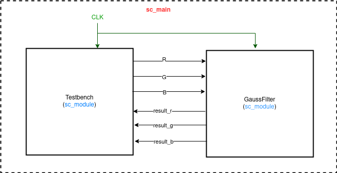

# Homework - 1 : gaussian filter

## I. Introduction
In this homework we are told to implement a gaussian filter in SystemC and C++. We were provided with a resource talking about different kinds of filters. Here we are dealing with a gaussian blur filter which is the result of blurring an image by a gaussian function (named after mathematician and scientist Carl Friedrich Gauss). The gauss function can be formulated as follows : 
> &space;=&space;\frac{1}{\sqrt{2\pi\sigma^2}}e^-\frac{x^{2}}{2\sigma^2})

It is a widely used effect in graphics software, typically to reduce image noise and reduce detail. The kernel I used is described here: 

```c++
double filter[filterHeight][filterWidth] =
{
  1, 2, 1,
  2, 4, 2,
  1, 2, 1,
};

double factor = 1.0 / 16.0;
double bias = 0.0;
```

## II. Implementation details
### _Part-1_ : C++ code

In this part I implemented the gaussian blur in C++ using the codes provided by the TAs and the [glm](https://glm.g-truc.net/0.9.9/index.html) library. GLM is a header of C++ mathematics library for graphics software based on the OpenGL Shading Language (GLSL) specifications. Convolution code is described here: 

```c++
unsigned char * GaussianBlur(unsigned char *scl, unsigned char *image_t, int w, int h, int ch, int r)
{
    int radius = static_cast<int>(ceil(r * 2.57));
    for (int i = 0; i < h; i++)
    {
        for (int j = 0; j < w*ch; j += ch)
        {
            glm::vec3 color = glm::vec3(0.0f);
            float allWeights = 0.0f;
            for (int ix = i - radius; ix < i + radius + 1; ix++)
            {
                for (int iy = j - radius*ch; iy < j + (radius + 1)*ch; iy += ch)
                {
                    int dsq = (iy / ch - j / ch)*(iy / ch - j / ch) + (ix - i)*(ix - i);// x^2 + y^2
                    float weight = exp(-dsq / (2 * r * r)) / (PI * 2 * r * r);// gaussian function: 1/(2*pi*sgima^2) * e^(-(x^2+y^2)/(2*sigma^2))

                    int x = glm::min((w - 1) * ch, glm::max(0, iy));
                    int y = glm::min(h - 1, glm::max(0, ix));

                    color.r += scl[y*w*ch + x] * weight;
                    color.g += scl[y*w*ch + x + 1] * weight;
                    color.b += scl[y*w*ch + x + 2] * weight;

                    allWeights += weight;
                }
            }
            image_t[i*w*ch + j] = glm::round(color.r / allWeights);
            image_t[i*w*ch + j + 1] = glm::round(color.g / allWeights);
            image_t[i*w*ch + j + 2] = glm::round(color.b / allWeights);
        }
    }
    return image_t;
}
```

### _Part-2_ : SystemC code

In this part I implemented the gaussian blur in SystemC using the codes provided by the TAs. The convolution function is described here : 

```c++
void Testbench::do_gauss(){
    unsigned char *scl = source_bitmap;
    unsigned char *tf = target_bitmap;
    int PI = 3.14;
    double R, G, B = 0.0;
    int w = width, h = height, ch = 3, r = 1;
    int radius = static_cast<int>(ceil(r * 2.57));
    
    o_rst.write(false);
    wait(5);
    o_rst.write(true);
    
    for (int i = 0; i < h; i++)
    {
        for (int j = 0; j < w*ch; j += ch)
        {
            glm::vec3 color = glm::vec3(0.0f);
            float allWeights = 0.0f;
            for (int ix = i - radius; ix < i + radius + 1; ix++)
            {
                for (int iy = j - radius*ch; iy < j + (radius + 1)*ch; iy += ch)
                {
                    int dsq = (iy / ch - j / ch)*(iy / ch - j / ch) + (ix - i)*(ix - i);// x^2 + y^2
                    float weight = exp(-dsq / (2 * r * r)) / (PI * 2 * r * r);// gaussian function: 1/(2*pi*sgima^2) * e^(-(x^2+y^2)/(2*sigma^2))
                    o_w.write(weight);

                    int x = glm::min((w - 1) * ch, glm::max(0, iy));
                    int y = glm::min(h - 1, glm::max(0, ix));

                    R = scl[y*w*ch + x] ;
                    G = scl[y*w*ch + x + 1] ;
                    B = scl[y*w*ch + x + 2] ;

                    color.r += R * weight;
                    color.g += G * weight;
                    color.b += B * weight;

                    allWeights += weight;
                    
                    o_r.write(R);
                    o_g.write(G);
                    o_b.write(B);
                }
            }
            tf[i*w*ch + j] = glm::round(color.r / allWeights);
            tf[i*w*ch + j + 1] = glm::round(color.g / allWeights);
            tf[i*w*ch + j + 2] = glm::round(color.b / allWeights);
        }
    }
```

## III. Design Model



## IV. Experimental results
|original input | blurred output|
|---------------|---------------|
|||

## V. Discussion and Conclusion
In this homework I learnt a lot about the gaussian blur filter. Starting with the c++ code to the SystemC code, TAs sample code has been very helpful. The most basic difference I felt was the sending of 3 results, i,e, result_r, result_g, result__b and not just one (unlike soble) from the gaussfilter.cpp file to the testbench.cpp file for file outpu/image dump.  
