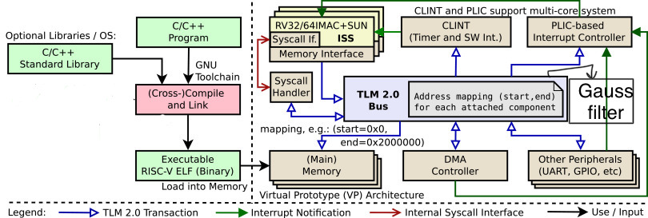

# Homework - 7 : gaussian filter in RISC-V multi-core

## I. Introduction
In this homework we are told to port the Gaussian blur module to a multi-core riscv-vp platform given by the TAs. We are guided to use the RISCV-VP core models to control hardware modules on the platform. RISC V virtual platform is implemented in SystemC TLM-2.0. It is useful scince it is flexible for both hardware and software simuntaneously. In this hw we have to add two Gaussian Blur modules to the 2-core riscv-vp platform ("tiny32-mc") by partitioning the image into equal parts and write a multi-core program to issue the processing to the two modules. Here we are dealing with a gaussian blur filter which is the result of blurring an image by a gaussian function (named after mathematician and scientist Carl Friedrich Gauss). The gauss function can be formulated as follows : 
>[1 / (2.pi.(sigma)^2)]e^-(x^2 / 2.(sigma)^2)]


It is a widely used effect in graphics software, typically to reduce image noise and reduce detail. The kernel I used is described here: 

```c++
double filter[filterHeight][filterWidth] =
{
  1, 2, 1,
  2, 4, 2,
  1, 2, 1,
};

double factor = 1.0 / 16.0;
double bias = 0.0;
```

## II. Implementation details

We are givena RISC V docker image which contains the source code for a sobel filter. We were asked to use these codes provided by the TAs for a gaussian blur filter. There are two parts in this implementation :

- Use RISCV-VP model with TLM 2.0 interface.
- Write a software application to control the hardware modules through bus.

Now I will show the things which are added in our case of gauss filter. First I will go through the Platform and then the src.

- Platform 
This time we are using the "timy-32-mc" in place of "basic-acc". Inside the platform we gave the gaussfilter.h file which is the main software link. TLM interconnects are used for data transfer. The code which is added on top of soble filter is mentioned here: 

 > NOTE: This is just some snaps from the code and not the complete code. 

```c++

sc_fifo<unsigned char> i_r;
sc_fifo<unsigned char> i_g;
sc_fifo<unsigned char> i_b;
sc_fifo<unsigned char> o_r;
sc_fifo<unsigned char> o_g;
sc_fifo<unsigned char> o_b;

SC_HAS_PROCESS(Filter);

Filter(sc_module_name n): 
    sc_module(n), 
    tsock("t_skt"), 
    base_offset(0) 
    {
        tsock.register_b_transport(this, &Filter::blocking_transport);
        SC_THREAD(do_filter);
    }

    ~Filter() {
    }
    void blocking_transport(tlm::tlm_generic_payload &payload, sc_core::sc_time &delay){
        wait(delay);
        tlm::tlm_command cmd = payload.get_command();
        sc_dt::uint64 addr = payload.get_address();
```
- Src
 The src folder contains the main.cpp file which is essential for hardware communicaton. Here since we are using multi-core, a lock mechanism is used constrolled by semaphores. First of all we define the number of processors, which here is 2. Then we initialise the semphore which is further called in write_data_to_ACC and read_data_to_ACC as sem_wait and sem_post. Finally there is a "hart_id" which helps switvh between the cores. if "0", core ) is being talked about and if "1" core 1 is functional. The sample code is decribed here : 

```c++

#define PROCESSORS 2

//Filter ACC
static char* const FILTER_START_ADDR[PROCESSORS] = {reinterpret_cast<char* const>(0x73000000),reinterpret_cast<char* const>(0x74000000)};
static char* const FILTER_READ_ADDR[PROCESSORS] = {reinterpret_cast<char* const>(0x73000004),reinterpret_cast<char* const>(0x74000004)};

int sem_init (uint32_t *__sem, uint32_t count) __THROW{
  *__sem=count;
  return 0;
}

void write_data_to_ACC(char* ADDR, unsigned char* buffer, int len, int hart_id){
    if(_is_using_dma){  
        // Using DMA 
	    sem_wait(&lock);
	    sem_post(&lock);

    }else{
        memcpy(ADDR, buffer, sizeof(unsigned char)*len);
    }
}
void read_data_from_ACC(char* ADDR, unsigned char* buffer, int len, int hart_id){
    if(_is_using_dma){
	    sem_post(&lock);
    }else{
        memcpy(buffer, ADDR, sizeof(unsigned char)*len);
    }
}

int main(unsigned hart_id) {

	if (hart_id == 0) {
		// create a barrier object with a count of PROCESSORS
		sem_init(&barrier_lock, 1);
		sem_init(&barrier_sem, 0); //lock all cores initially
		for(int i=0; i< 2; ++i){
			sem_init(&print_sem[i], 0); //lock printing initially
		}
		// Create mutex lock
		sem_init(&lock, 1);
	}

for(int i = width_start; i < width_end; i++) {
      for(int j = 0; j < length; j++) {
        for(int v = -1; v <= 1; v ++) {
          for(int u = -1; u <= 1; u++) {
            if((v + i) >= 0  &&  (v + i ) < width && (u + j) >= 0 && (u + j) < length){
                buffer[0] = *(source_bitmap + bytes_per_pixel * ((j + u) * width + (i + v)) + 2);
            }
            else{
                buffer[0] = 0;
              
            }
            write_data_to_ACC(FILTER_START_ADDR[hart_id], buffer, 4, hart_id);
			      if(hart_id == 0) continue;
            
          }
        }
        read_data_from_ACC(FILTER_READ_ADDR[hart_id], buffer, 4, hart_id);
			  if(hart_id == 0) continue;
              }
    }

	barrier(&barrier_sem, &barrier_lock, &barrier_counter, PROCESSORS);

	if (hart_id == 0) sem_post(&print_sem[1]); 
  return 0;
}

```

## III. Design Model



## IV. Experimental results

### 1. We will first build the "tiny-32-mc" platform of riscv-vp and run the vp as follow : 

```sh
$ cd build
$ cmake ..
$ make install
-----------------------------------------------------------
user@ubuntu:~/ee6470/riscv-vp/vp/build$ make install
[  8%] Built target core-common
[ 17%] Built target gdb
[ 25%] Built target gdb-mc
[ 29%] Built target rv32
[ 34%] Built target rv64
[ 44%] Built target platform-common
[ 49%] Built target platform-basic
[ 52%] Built target riscv-vp
[ 56%] Built target platform-basic-acc
[ 59%] Built target riscv-vp-acc
[ 74%] Built target hifive-vp
[ 77%] Built target tiny32-vp
[ 80%] Built target tiny32-mc
[ 85%] Built target platform-tiny32-mc
[ 88%] Built target tiny64-vp
[ 91%] Built target tiny64-mc
[ 94%] Built target test32-vp
[ 97%] Built target linux-vp
[100%] Built target linux32-vp
Install the project...
-- Install configuration: "Debug"

```
### 2. Next we will run the basic gaussian filter software (sw) as follow 

```sh
$ cd $EE6470
$ cd riscv-vp/sw
$ cd gauss_multi_core
$ make
$ make sim
--------------------------------------------------------------
user@ubuntu:~/ee6470/riscv-vp/sw/gauss$ make sim
        SystemC 2.3.3-Accellera --- Jun 17 2021 16:50:52
        Copyright (c) 1996-2018 by all Contributors,
        ALL RIGHTS RESERVED
======================================
======================================

Info: /OSCI/SystemC: Simulation stopped by user.
=[ core : 0 ]===========================
simulation time: 1764293080 ns
zero (x0) =        0
ra   (x1) =    10938
sp   (x2) =    18a00
gp   (x3) =    53104
tp   (x4) =        0
t0   (x5) =  2010000
t1   (x6) =        1
t2   (x7) =        1
s0/fp(x8) =        0
s1   (x9) =        0
a0  (x10) =        0
a1  (x11) =    538b4
a2  (x12) =    538b0
a3  (x13) =        2
a4  (x14) =        1
a5  (x15) =        0
a6  (x16) =        0
a7  (x17) =       5d
s2  (x18) =        0
s3  (x19) =        0
s4  (x20) =        0
s5  (x21) =        0
s6  (x22) =        0
s7  (x23) =        0
s8  (x24) =        0
s9  (x25) =        0
s10 (x26) =        0
s11 (x27) =        0
t3  (x28) =        0
t4  (x29) =        0
t5  (x30) =     8800
t6  (x31) =        5
pc = 10964
num-instr = 45436798
=[ core : 1 ]===========================
simulation time: 1764293080 ns
zero (x0) =        0
ra   (x1) =    10938
sp   (x2) =    20a00
gp   (x3) =    53104
tp   (x4) =        0
t0   (x5) =    20a00
t1   (x6) =        1
t2   (x7) =        1
s0/fp(x8) =        0
s1   (x9) =        0
a0  (x10) =        0
a1  (x11) =    538b4
a2  (x12) =    538b0
a3  (x13) =        2
a4  (x14) =        1
a5  (x15) =        0
a6  (x16) =   525270
a7  (x17) =    209c0
s2  (x18) =        0
s3  (x19) =        0
s4  (x20) =        0
s5  (x21) =        0
s6  (x22) =        0
s7  (x23) =        0
s8  (x24) =        0
s9  (x25) =        0
s10 (x26) =        0
s11 (x27) =        0
t3  (x28) =        3
t4  (x29) =        0
t5  (x30) =     8800
t6  (x31) =        5
pc = 1094c
num-instr = 45434145


```


## V. Discussion and Conclusion
In this homework I learnt to port gaussian filter with multi-core risc-V vp. The "tiny-32-mc" codes provided by TAs has been very helpful, since its hard and complicated to bulit it from scratch. I learnt the use of semaphore, which is a lock mechanism used in case of multiple cores. This is very useful for parallel computing, a very nioce concept learnt.  


