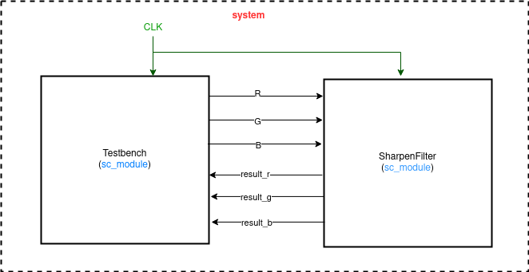
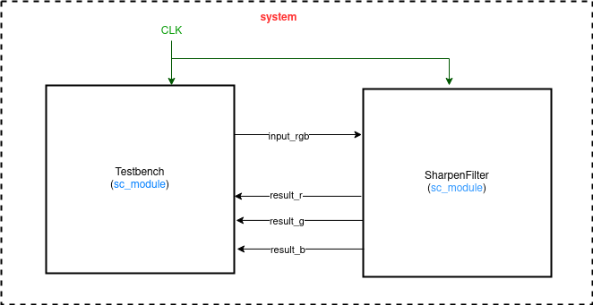

# Midterm : Sharpen filter with Stratus HLS

## I. Introduction
For my mid-term project I implemented another image processing algorithm, the sharpen filter. I first implemented the sharpen filter in SystemC and then to synthesize the kernel function of the sharpen filter and then used  Stratus HLS to annotate the timing back to the platform. Stratus High level Design automates the design and verification flow of hundreds of blocks from transaction-level models (TLMs) to gates. Here we are dealing with a sharpen filter. To sharpen the image add the original image, and the image after the edge detection to each other, and the result will be a new image where the edges are enhanced, making it look sharper. Adding those two images is done by taking the edge detection filter and incrementing the center value of it with 1. Now the sum of the filter elements is 1 and the result will be an image with the same brightness as the original, but sharper.

The kernel I used is described here: 

```c++
#define filterWidth 3
#define filterHeight 3

double filter[filterHeight][filterWidth] =
{
  -1, -1, -1,
  -1,  9, -1,
  -1, -1, -1
};

double factor = 1.0;
double bias = 0.0;


```

## II. Implementation details

We are given synthesizable codes for sobel filter by the TAs. We were given all the stratus files required for hardware level synthesis. In this part I implemented the a sharpen filter in stratus HLS using the codes provided by the TAs. Then for further optimisation, I did the following: 
- splitted
- splitted_unroll
- splitted_pipeline
- splitted_data_reuse

- Split 
  In this part the output which will be sent from sharpenFilter module to Testbench is treated separately, i.e, all the values of R,G and B are sent separately to the testbench. The architecture for this is mentioned in later section while the sample code for this is described here: 
```c++
for (unsigned int v = 0; v < MASK_Y; ++v) {
			for (unsigned int u = 0; u < MASK_X; ++u) {
				sc_dt::sc_uint<8> r;
				sc_dt::sc_uint<8> g;
				sc_dt::sc_uint<8> b;
#ifndef NATIVE_SYSTEMC
				{
					HLS_DEFINE_PROTOCOL("input");
					r = input_r.get();
					g = input_g.get();
					b = input_b.get();
					wait();
				}
#else
				r = input_r.read();
				g = input_g.read();
				b = input_b.read();
#endif
				{
					HLS_CONSTRAIN_LATENCY(0, 2, "lat01");
        			if (r != 0 && g != 0 && b !=0 ) cnt += mask[u][v];
					r_val += r * mask[u][v];
					g_val += g * mask[u][v];
					b_val += b * mask[u][v];
				}
			}
```
- Non - Split
 In this part the output which will be sent from Gaussfilter module to Testbench is treated together as an array. Since all the R, G and B values are of 8 bits a 24 bit array is created and all the values are stored in this in a concatenated manner. The sample code is decribed here : 

```c++
for (unsigned int v = 0; v < MASK_Y; ++v) {
			for (unsigned int u = 0; u < MASK_X; ++u) {
				sc_dt::sc_uint<24> rgb;
#ifndef NATIVE_SYSTEMC
				{
					HLS_DEFINE_PROTOCOL("input");
					rgb = i_rgb.get();
					wait();
				}
#else
				rgb = i_rgb.read();
#endif
				{
					HLS_CONSTRAIN_LATENCY(0, 2, "lat01");
        			if ((rgb(7, 0) != 0) && (rgb(15, 8) != 0) && (rgb(23, 16) != 0)) cnt += mask[u][v];
					r_val += rgb(7, 0) * mask[u][v];
					g_val += rgb(15, 8) * mask[u][v];
					b_val += rgb(23, 16) * mask[u][v];
				}
			}
```
- Loop unrolling and Loop pipeline

```c++
HLS_UNROLL_LOOP(CONSERVATIVE,2, "shift");
HLS_PIPELINE_LOOP(HARD_STALL, 1, "main_loop_pipeline");
HLS_CONSTRAIN_LATENCY(0, 2, "lat01");
```

## III. Design Model
|Splitted| Non-Splitted|
|---------------|---------------|
|||


## IV. Experimental results

|original input | blurred output|
|---------------|---------------|
|||

### 1. Splitted

#### Area

| BASIC     | DPA  |
| ------- | ----- | 
| 2352.1 | 2108.2 | 


### 2. Non-Splitted

#### Area

| BASIC     | DPA  |
| ------- | ----- | 
| 2873.7 | 2509.2 | 


## V. Discussion and Conclusion
In this homework I learnt the use of stratus high level sysnthesis. We experiment with diffrent kinds of simulations like sim_B, sim_V_BASIC and sim_V_DPA. The TAs sample code has been very helpful in writing the stratus codes. This was the first time we did Hardware level synthesis which was quite helpful.  

